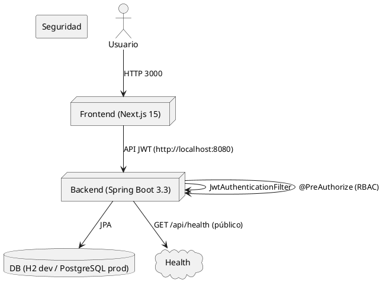

# ARQUITECTURA TÉCNICA - SISTEMA DE GESTIÓN VETERINARIA

## 1. STACK TECNOLÓGICO

### Frontend
- **Framework**: Next.js 15 (React 18)
- **Lenguaje**: TypeScript
- **Styling**: Tailwind CSS v4
- **UI Components**: shadcn/ui + custom components
- **State Management**: React Context + hooks
- **Data Fetching**: Cliente HTTP `lib/api.ts` con manejo de 401/403
- **Form Handling**: React Hook Form
- **Validación**: Zod (cliente)
- **Icons**: Lucide React
- **Tables**: TanStack Table
- **Dates**: date-fns
- **Notificaciones**: sonner

### Backend
- **Runtime**: Java 17+
- **Framework**: Spring Boot 3.3.x
- **Database**: JPA (H2 dev / PostgreSQL prod)
- **Validación**: Bean Validation
- **Autenticación**: JWT (Spring Security)
- **Hash de contraseñas**: BCrypt
- **CORS**: configuración Spring global
- **Logging**: Logging integrado

### DevOps & Deployment
- **Hosting**: Vercel (production), local (development)
- **Database Hosting**: Neon PostgreSQL (production), local PostgreSQL (development)
- **Version Control**: GitHub
- **CI/CD**: GitHub Actions (testing, linting)
- **Monitoring**: Sentry (error tracking)
- **Analytics**: Vercel Analytics

## 2. ARQUITECTURA DE CAPAS

\`\`\`
┌─────────────────────────────────────────┐
│         PRESENTACIÓN (UI)               │
│     React Components / Pages             │
└─────────────────────────────────────────┘
           ↓
┌─────────────────────────────────────────┐
│     LÓGICA DE NEGOCIO (Hooks/Utilities)  │
│   useAuth, useFetch, validations        │
└─────────────────────────────────────────┘
           ↓
┌─────────────────────────────────────────┐
│   REST CONTROLLERS (Spring Boot)        │
│   /api/auth, /api/mascotas, /api/citas  │
└─────────────────────────────────────────┘
           ↓
┌─────────────────────────────────────────┐
│      SERVICES (Business Logic)          │
│   Auth service, Mascota service, etc.   │
└─────────────────────────────────────────┘
           ↓
┌─────────────────────────────────────────┐
│      VALIDATORS (Zod Schemas)           │
│   Validaciones de datos                 │
└─────────────────────────────────────────┘
           ↓
┌─────────────────────────────────────────┐
│      DATABASE LAYER                     │
│   PostgreSQL + Queries                  │
└─────────────────────────────────────────┘
\`\`\`

## 3. ESTRUCTURA DE CARPETAS

\`\`\`
veterinary-app/
├── app/
│   ├── (auth)/
│   │   ├── login/
│   │   │   └── page.tsx
│   │   ├── register/
│   │   │   └── page.tsx
│   │   └── layout.tsx
│   ├── (dashboard)/
│   │   ├── dashboard/
│   │   │   ├── page.tsx
│   │   │   ├── mascotas/
│   │   │   │   ├── page.tsx
│   │   │   │   ├── nueva/
│   │   │   │   │   └── page.tsx
│   │   │   │   └── [id]/
│   │   │   │       └── page.tsx
│   │   │   ├── citas/
│   │   │   │   ├── page.tsx
│   │   │   │   └── nueva/
│   │   │   │       └── page.tsx
│   │   │   ├── historial/
│   │   │   │   └── page.tsx
│   │   │   ├── certificados/
│   │   │   │   └── page.tsx
│   │   │   └── vacunas/
│   │   │       └── page.tsx
│   │   ├── (admin)/
│   │   │   ├── admin/
│   │   │   │   ├── page.tsx
│   │   │   │   ├── usuarios/
│   │   │   │   │   └── page.tsx
│   │   │   │   ├── reportes/
│   │   │   │   │   └── page.tsx
│   │   │   │   └── auditoria/
│   │   │   │       └── page.tsx
│   │   │   └── layout.tsx
│   │   └── layout.tsx
│   ├── api/
│   │   ├── auth/
│   │   │   ├── register/
│   │   │   │   └── route.ts
│   │   │   ├── login/
│   │   │   │   └── route.ts
│   │   │   └── logout/
│   │   │       └── route.ts
│   │   ├── mascotas/
│   │   │   ├── route.ts
│   │   │   └── [id]/
│   │   │       └── route.ts
│   │   ├── citas/
│   │   │   ├── route.ts
│   │   │   ├── disponibilidad/
│   │   │   │   └── route.ts
│   │   │   └── [id]/
│   │   │       └── route.ts
│   │   ├── historial/
│   │   │   ├── route.ts
│   │   │   └── [mascota_id]/
│   │   │       └── route.ts
│   │   ├── certificados/
│   │   │   ├── route.ts
│   │   │   ├── [id]/
│   │   │   │   └── route.ts
│   │   │   └── verificar/
│   │   │       └── route.ts
│   │   ├── vacunas/
│   │   │   ├── route.ts
│   │   │   └── [id]/
│   │   │       └── route.ts
│   │   └── admin/
│   │       ├── stats/
│   │       │   └── route.ts
│   │       └── usuarios/
│   │           └── route.ts
│   ├── page.tsx
│   ├── layout.tsx
│   └── globals.css
├── components/
│   ├── ui/
│   │   ├── button.tsx
│   │   ├── card.tsx
│   │   ├── input.tsx
│   │   ├── select.tsx
│   │   ├── textarea.tsx
│   │   ├── badge.tsx
│   │   └── ... (otros componentes base)
│   ├── forms/
│   │   ├── mascota-form.tsx
│   │   ├── cita-form.tsx
│   │   ├── historial-form.tsx
│   │   └── certificado-form.tsx
│   ├── tables/
│   │   ├── mascotas-table.tsx
│   │   ├── citas-table.tsx
│   │   └── usuarios-table.tsx
│   ├── layout/
│   │   ├── sidebar.tsx
│   │   ├── navbar.tsx
│   │   ├── header.tsx
│   │   └── footer.tsx
│   └── shared/
│       ├── loading-spinner.tsx
│       ├── empty-state.tsx
│       ├── error-boundary.tsx
│       └── toast-notifications.tsx
├── lib/
│   ├── db.ts                    # Conexión a BD
│   ├── auth.ts                  # Funciones de JWT
│   ├── validators.ts            # Zod schemas
│   ├── utils.ts                 # Utilidades generales
│   ├── api-client.ts            # Cliente HTTP
│   ├── date-utils.ts            # Utilidades de fechas
│   └── constants.ts             # Constantes
├── types/
│   └── index.ts                 # TypeScript interfaces
├── hooks/
│   ├── use-auth.ts
│   ├── use-fetch.ts
│   ├── use-form.ts
│   └── use-toast.ts
├── services/
│   ├── auth-service.ts
│   ├── mascota-service.ts
│   ├── cita-service.ts
│   └── historial-service.ts
├── scripts/
│   ├── init-db.sql
│   └── seed-data.sql
├── docs/
│   ├── CONTEXTO.md
│   ├── MODELO_DATOS.md
│   ├── FUNCIONALIDADES.md
│   ├── ARQUITECTURA.md
│   ├── DIAGRAMAS.md
│   └── API_REFERENCE.md
├── .env.example
├── .env.local                   # Desarrollo
├── .gitignore
├── package.json
├── tsconfig.json
├── next.config.mjs
├── tailwind.config.ts
├── README.md
└── middleware.ts
\`\`\`

## 4. FLUJO DE AUTENTICACIÓN

\`\`\`
Usuario ingresa credenciales
         ↓
POST /api/auth/login
         ↓
Validar email existe
         ↓
Comparar contraseña con hash
         ↓
Generar JWT (24h)
         ↓
Guardar en cookie (httpOnly, secure)
         ↓
Retornar user data al frontend
         ↓
Frontend almacena en context/state
         ↓
Middleware intercepta requests
         ↓
Verifica JWT en cookie
         ↓
Si válido → permitir
Si inválido → redirigir a login
\`\`\`

## 5. FLUJO DE CREACIÓN DE CITA

\`\`\`
Dueño abre "Agendar Cita"
         ↓
GET /api/citas/disponibilidad
         ↓
Sistema obtiene horarios veterinario
         ↓
Sistema obtiene citas existentes
         ↓
Calcula slots libres (15+ minutos)
         ↓
Frontend muestra disponibilidad
         ↓
Dueño selecciona slot
         ↓
POST /api/citas (con validaciones Zod)
         ↓
Validar datos en servidor
         ↓
Verificar disponibilidad nuevamente
         ↓
Crear registro en BD
         ↓
Enviar email de confirmación
         ↓
Programar recordatorios (24h, 1h)
         ↓
Retornar cita creada al frontend
         ↓
Mostrar mensaje de éxito
\`\`\`

## 6. SEGURIDAD

### Autenticación
- JWT con firma HS256 (secreto en variable de entorno)
- Tokens de 24 horas
- Refresh token en cookie (opcional para escalada)
- Cookies httpOnly y secure (production)

### Autorización
- Filtro JWT en Spring Security (`JwtAuthenticationFilter`)
- Control de acceso por rol en controllers (`@PreAuthorize`)
- Validaciones en cliente y servidor

### Validación
- Zod en cliente y servidor (compartido)
- Escape de SQL (queries parametrizadas)
- Rate limiting en API routes

### Contraseñas
- Hasheadas con BCrypt (factor 12)
- Nunca almacenadas en plain text
- Reset token temporal (30 minutos)

### Datos Sensibles
- Soft deletes (nunca borrar datos)
- Audit log inmutable
- Logs de acceso
- Rastreo de cambios (before/after)

## 7. MANEJO DE ERRORES

### Cliente (Frontend)
- Try-catch en componentes
- Error boundaries
- Toast notifications
- Fallback UI

### Servidor (Spring Boot)
- Try-catch en routes
- Logs estructurados
- Respuestas de error normalizadas
- Status HTTP apropiados

### Errores Comunes
\`\`\`
{
  success: false,
  error: "Descripción del error",
  code: "ERROR_CODE",
  status: 400
}
\`\`\`

## 8. ESCALABILIDAD

### Optimizaciones Implementadas
- Índices en BD en campos frecuentemente consultados
- Paginación en listados
- SWR para caching cliente
- Lazy loading de componentes
- Compresión de assets
- CDN para imágenes

### Posibles Mejoras Futuras
- Redis para cache
- GraphQL para queries optimizadas
- Microservicios para funciones
- Message queue para emails
- CDN global

## 9. DEPLOYMENT

### Desarrollo Local
\`\`\`bash
# Backend
cd springboot
mvn -q -DskipTests spring-boot:run
# http://localhost:8080

# Frontend
cd ..
npm install
npm run dev -- -p 3000
# http://localhost:3000
\`\`\`

### Staging (Vercel)
- Branch: `develop`
- Auto-deploy en cada push
- Preview URLs

### Producción (Vercel)
- Branch: `main`
- Requiere pull request y review
- Monitoreo con Sentry
- Logs con Vercel Analytics

## 10. INTEGRACIONES FUTURAS

- **Email**: SendGrid para transaccionales
- **SMS**: Twilio para recordatorios
- **Pagos**: Stripe para consultas
- **Video**: Telemedicina
- **Maps**: Ubicación de clínica
- **Analytics**: Dashboard de negocio
\`\`\`

</markdown>
