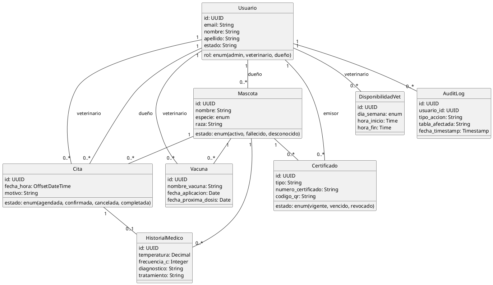
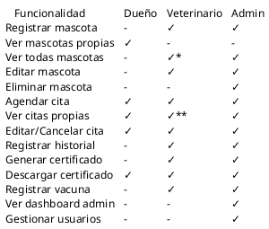
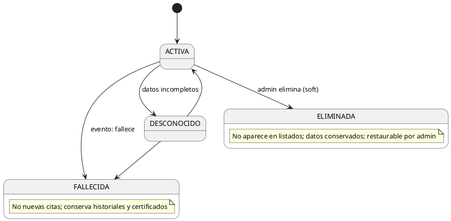

# DIAGRAMAS - SISTEMA DE GESTIÓN VETERINARIA

## Estado y Navegación

- Diagramas actualizados se encuentran en:
  - `docs/diagrams/*.svg`
  - fuentes PlantUML en `docs/puml/*.puml`
- Arquitectura refleja Next.js (frontend) comunicándose con Spring Boot (backend) vía REST con JWT.
- ER incluye entidades: `Usuario`, `Mascota`, `Cita`, `HistorialMedico`, `Certificado`, `Vacuna`, `AuditLog`.

Enlaces:
- Arquitectura: `docs/diagrams/arquitectura.svg`
- ER: `docs/diagrams/er.svg`
- Flujo de cita: `docs/diagrams/flow_cita.svg`
- Permisos: `docs/diagrams/permisos.svg`

## 1. DIAGRAMA DE CASOS DE USO

### Actores
- **Usuario Anónimo**: No autenticado
- **Dueño de Mascota**: Cliente final
- **Veterinario**: Profesional de salud
- **Recepcionista**: Apoyo administrativo
- **Administrador**: Gestor del sistema

### Casos de Uso Principales

\`\`\`
                    ┌─────────────────────┐
                    │  Usuario Anónimo    │
                    └──────────┬──────────┘
                               │
                    ┌──────────┴──────────┐
                    │                     │
              ┌─────▼─────┐         ┌─────▼─────┐
              │  Registrar │         │   Login   │
              └───────────┘         └───────────┘

            ┌─────────────────────────────────────┐
            │      Dueño de Mascota               │
            └──────────┬──────────────────────────┘
                       │
        ┌──────────────┼──────────────┐
        │              │              │
   ┌────▼──────┐  ┌───▼────┐  ┌─────▼──────┐
   │Agendar    │  │Ver Cita│  │Descargar   │
   │Cita       │  │        │  │Certificado │
   └───────────┘  └────────┘  └────────────┘

            ┌─────────────────────────────────────┐
            │        Veterinario                  │
            └──────────┬──────────────────────────┘
                       │
        ┌──────────────┼──────────────────────┐
        │              │                      │
   ┌────▼──────┐  ┌───▼────────┐  ┌─────────▼─┐
   │Registrar  │  │Generar     │  │Ver        │
   │Historial  │  │Certificado │  │Disponib.  │
   └───────────┘  └────────────┘  └───────────┘

            ┌─────────────────────────────────────┐
            │        Recepcionista                │
            └──────────┬──────────────────────────┘
                       │
        ┌──────────────┼──────────────────────┐
        │              │                      │
   ┌────▼──────┐  ┌───▼────┐  ┌─────────────▼┐
   │Agendar    │  │Registrar│  │Cancelar     │
   │Cita       │  │Mascota  │  │Cita         │
   └───────────┘  └────────┘  └─────────────┘

            ┌─────────────────────────────────────┐
            │        Administrador                │
            └──────────┬──────────────────────────┘
                       │
        ┌──────────────┼──────────────────────┐
        │              │                      │
   ┌────▼──────┐  ┌───▼────┐  ┌─────────────▼┐
   │Gestionar  │  │Ver Stats│  │Ver Auditoria│
   │Usuarios   │  │         │  │             │
   └───────────┘  └────────┘  └─────────────┘
\`\`\`

---

## 2. DIAGRAMA ENTIDAD-RELACIÓN (ER)

\`\`\`
┌──────────────────┐
│    USUARIOS      │
├──────────────────┤
│ id (PK)          │
│ email (UNIQUE)   │
│ nombre           │
│ apellido         │
│ contraseña_hash  │
│ teléfono         │
│ rol              │
│ estado           │
└────────┬─────────┘
         │
    ┌────┼────┐
    │    │    │
    │    │    └──────────────────────┐
    │    │                           │
    │    └──────────┐                │
    │               │                │
    │          ┌────▼──────────┐     │
    │          │   MASCOTAS    │     │
    │          ├───────────────┤     │
    │          │ id (PK)       │     │
    │          │ dueño_id (FK) │     │
    │  (1)     │ nombre        │     │
    │    └─────┤ especie       │     │
    │          │ raza          │     │
    │          │ peso          │     │
    │          │ edad          │     │
    │          └────┬──────────┘     │
    │               │ (1)            │
    │          ┌────┼────────────┐   │
    │          │ (N)            │   │
    │   ┌──────▼──────────┐     │   │
    │   │     CITAS       │     │   │
    │   ├─────────────────┤     │   │
    │   │ id (PK)         │     │   │
    │   │ mascota_id (FK) │     │   │
    │   │ veterinario_id  │     │   │
    │   │ dueño_id (FK)   │     │   │
    │   │ fecha_hora      │     │   │
    │   │ motivo          │     │   │
    │   │ estado          │     │   │
    │   └────┬────────────┘     │   │
    │        │ (1)              │   │
    │   ┌────▼──────────────┐   │   │
    │   │ HISTORIAL_MEDICO │   │   │
    │   ├───────────────────┤   │   │
    │   │ id (PK)           │   │   │
    │   │ cita_id (FK)      │   │   │
    │   │ mascota_id (FK)   │───┘   │
    │   │ temperatura       │       │
    │   │ frecuencia_c      │       │
    │   │ diagnostico       │       │
    │   │ tratamiento       │       │
    │   └───────────────────┘       │
    │                              │
    └──────────────┬────────────────┘
                   │ (N)
        ┌──────────▼──────────┐
        │  CERTIFICADOS       │
        ├─────────────────────┤
        │ id (PK)             │
        │ mascota_id (FK)     │
        │ veterinario_id (FK) │
        │ tipo                │
        │ numero_certificado  │
        │ codigo_qr           │
        │ estado              │
        └─────────────────────┘

        ┌──────────────────────┐
        │     VACUNAS          │
        ├──────────────────────┤
        │ id (PK)              │
        │ mascota_id (FK)      │
        │ nombre_vacuna        │
        │ fecha_aplicacion     │
        │ fecha_proxima_dosis  │
        │ veterinario_id (FK)  │
        └──────────────────────┘

        ┌──────────────────────┐
        │  DISPONIBILIDAD_VET  │
        ├──────────────────────┤
        │ id (PK)              │
        │ veterinario_id (FK)  │
        │ dia_semana           │
        │ hora_inicio          │
        │ hora_fin             │
        └──────────────────────┘

        ┌──────────────────────┐
        │   AUDIT_LOG          │
        ├──────────────────────┤
        │ id (PK)              │
        │ usuario_id (FK)      │
        │ tipo_accion          │
        │ tabla_afectada       │
        │ datos_anteriores     │
        │ datos_nuevos         │
        │ fecha_timestamp      │
        └──────────────────────┘

        ┌──────────────────────┐
        │  RECORDATORIOS       │
        ├──────────────────────┤
        │ id (PK)              │
        │ cita_id (FK)         │
        │ tipo                 │
        │ dueño_id (FK)        │
        │ estado               │
        │ fecha_programada     │
        └──────────────────────┘
\`\`\`

---

## 3. FLUJO DE AGENDAMIENTO DE CITA

\`\`\`
START
  │
  ├─ Usuario selecciona mascota
  │
  ├─ Sistema obtiene:
  │   ├─ Horarios veterinarios disponibles
  │   ├─ Citas ya agendadas
  │   └─ Calcula slots libres
  │
  ├─ Usuario selecciona slot (fecha, hora, duración)
  │
  ├─ Usuario ingresa motivo de consulta
  │
  ├─ Validaciones:
  │   ├─ Motivo 10-500 caracteres ✓
  │   ├─ Duración 15-120 minutos ✓
  │   ├─ Fecha es futura ✓
  │   ├─ Veterinario disponible ✓
  │   └─ Mascota no tiene 2+ citas ese día ✓
  │
  ├─ Sistema crea CITA (estado: agendada)
  │
  ├─ Sistema genera:
  │   ├─ UUID único
  │   ├─ Timestamp de creación
  │   └─ Cálculo de fecha_hora_fin
  │
  ├─ Enviar email:
  │   ├─ Al dueño (confirmación)
  │   └─ Al veterinario (notificación)
  │
  ├─ Programar recordatorios:
  │   ├─ 24 horas antes
  │   └─ 1 hora antes
  │
  ├─ Crear AUDIT_LOG:
  │   ├─ usuario_id = quien agendó
  │   ├─ acción = CREATE
  │   └─ tabla = citas
  │
  ├─ Retornar cita creada
  │
  └─ FIN (Éxito)

ERRORES:
  ├─ Email no existe → Error 404
  ├─ Validación falla → Error 400 + detalles
  ├─ Veterinario no disponible → Error 409
  └─ BD error → Error 500
\`\`\`

---

## 4. FLUJO DE GENERACIÓN DE CERTIFICADO

\`\`\`
START
  │
  ├─ Veterinario selecciona tipo:
  │   ├─ SALUD
  │   ├─ VACUNACION
  │   ├─ DESPARASITACION
  │   └─ VIAJE
  │
  ├─ Sistema verifica requisitos:
  │   │
  │   ├─ Si SALUD:
  │   │   └─ ¿Existe cita completada en últimos 30 días? ✓
  │   │
  │   ├─ Si VACUNACION:
  │   │   └─ ¿Existe registro de vacuna? ✓
  │   │
  │   ├─ Si DESPARASITACION:
  │   │   └─ ¿Existe en historial médico? ✓
  │   │
  │   └─ Si VIAJE:
  │       └─ ¿Cumple requisitos por país? ✓
  │
  ├─ Veterinario ingresa detalles
  │
  ├─ Sistema genera:
  │   ├─ NUMERO_CERTIFICADO: AUTO-UUID
  │   ├─ CODIGO_QR: Hash único (URL verificable)
  │   └─ PDF: Con logo, firma, datos mascota
  │
  ├─ Crear registro CERTIFICADOS:
  │   ├─ numero_certificado (UNIQUE)
  │   ├─ codigo_qr (UNIQUE)
  │   ├─ estado = vigente
  │   └─ fecha_vencimiento (futura)
  │
  ├─ Crear AUDIT_LOG (CREATE)
  │
  ├─ Notificar dueño:
  │   └─ Email: "Tu certificado está listo"
  │
  ├─ Dueño descarga PDF
  │   ├─ Registrar en audit
  │   └─ Actualizar descargado_por_dueño = true
  │
  ├─ Verificación online (QR):
  │   ├─ Usuario escanea código
  │   ├─ GET /api/certificados/verificar/:codigo_qr
  │   ├─ Sistema busca certificado
  │   └─ Muestra estado (VIGENTE/VENCIDO)
  │
  └─ FIN
\`\`\`

---

## 5. MATRIZ DE PERMISOS POR ROL

| Funcionalidad | Dueño | Veterinario | Recepcionista | Admin |
|---|---|---|---|---|
| Registrarse | ✓ | - | - | - |
| Login | ✓ | ✓ | ✓ | ✓ |
| Ver perfil | ✓ | ✓ | ✓ | ✓ |
| Editar perfil | ✓ | ✓ | ✓ | ✓ |
| **Mascotas** | | | | |
| Registrar mascota | ✓ | - | ✓ | ✓ |
| Ver mascotas propias | ✓ | - | - | - |
| Ver todas mascotas | - | ✓* | ✓ | ✓ |
| Editar mascota | ✓* | - | ✓ | ✓ |
| Eliminar mascota | - | - | ✓ | ✓ |
| **Citas** | | | | |
| Agendar cita | ✓ | - | ✓ | ✓ |
| Ver citas propias | ✓ | ✓** | ✓ | ✓ |
| Ver disponibilidad | ✓ | - | ✓ | ✓ |
| Editar cita | - | - | ✓ | ✓ |
| Cancelar cita | ✓ | - | ✓ | ✓ |
| **Historial Médico** | | | | |
| Registrar historial | - | ✓ | - | ✓ |
| Ver historial propio | ✓ | ✓ | ✓ | ✓ |
| Ver todo historial | - | - | ✓ | ✓ |
| Editar historial | - | ✓*** | - | ✓ |
| **Certificados** | | | | |
| Generar certificado | - | ✓ | - | ✓ |
| Ver certificados | ✓ | ✓ | ✓ | ✓ |
| Descargar PDF | ✓ | ✓ | ✓ | ✓ |
| Revocar certificado | - | ✓**** | - | ✓ |
| **Vacunas** | | | | |
| Registrar vacuna | - | ✓ | - | ✓ |
| Ver vacunas | ✓ | ✓ | ✓ | ✓ |
| Editar vacuna | - | ✓ | - | ✓ |
| **Admin** | | | | |
| Ver dashboard | - | - | ✓ | ✓ |
| Gestionar usuarios | - | - | - | ✓ |
| Ver reportes | - | - | ✓ | ✓ |
| Ver auditoría | - | - | - | ✓ |

**Notas**:
- ✓* Solo si es su mascota
- ✓** Solo sus citas asignadas
- ✓*** Dentro de 24h de creación
- ✓**** Solo si él la emitió

---

## 6. CICLO DE VIDA DE UNA MASCOTA

\`\`\`
┌────────┐
│ ACTIVA │ ← Estado inicial al registrarse
└────┬───┘
     │
     ├─ Puede agendar citas
     ├─ Puede tener historiales
     ├─ Puede tener certificados
     ├─ Puede tener vacunas
     │
     ├─ Pasa por múltiples citas
     │
     └─→ (Evento: Mascota fallece)
            │
            ├─→ ┌──────────┐
                │ FALLECIDA │
                └──────────┘
                   │
                   ├─ No permite nuevas citas
                   ├─ Conserva historiales
                   ├─ Conserva certificados
                   └─ No se puede editar
            
     ├─→ (Evento: Datos incompletos/desconocido)
            │
            ├─→ ┌──────────┐
                │ DESCONOCIDO
                └──────────┘
                   │
                   ├─ Estado temporal
                   ├─ Permite edición
                   └─ Transición a ACTIVA o FALLECIDA

     └─→ (Evento: Admin elimina)
            │
            ├─→ ┌──────────────────┐
                │ ELIMINADA (soft)  │
                └──────────────────┘
                   │
                   ├─ No aparece en listados
                   ├─ Datos conservados en BD
                   └─ Solo admin puede restaurar
\`\`\`

---

## 7. CICLO DE VIDA DE UNA CITA

\`\`\`
┌──────────┐
│AGENDADA  │ ← Se crea al agendar
└────┬─────┘
     │
     ├─ Dueño puede cancelar → CANCELADA
     ├─ Recepcionista puede editar
     │
     └─→ Dueño confirma
        └──────────────────┐
                           │
                    ┌──────▼───────┐
                    │  CONFIRMADA  │ ← Confirmación recibida
                    └──────┬───────┘
                           │
                           ├─ Enviar recordatorios (24h, 1h)
                           ├─ Dueño puede cancelar → CANCELADA
                           │
                           └─→ Llega fecha/hora
                              └──────────────────┐
                                                 │
                          ┌──────────┬──────────┬┴────────────┐
                          │          │          │             │
                    ┌─────▼─────┐   │    ┌────▼──────┐  ┌───▼──────┐
                    │ COMPLETADA│   │    │ NO ASISTIO│  │CANCELADA │
                    └────┬──────┘   │    └───────────┘  └──────────┘
                         │          │
                    Vet registra    │
                    historial       │
                         │          │
                         └─→ [FIN]
\`\`\`

---

## 8. CICLO DE VIDA DE UN CERTIFICADO

\`\`\`
┌─────────┐
│ VIGENTE │ ← Se genera
└────┬────┘
     │
     ├─ Dueño descarga PDF
     │
     ├─ Se puede verificar por QR (online)
     │
     ├─ Tiempo pasa...
     │
     └─→ Llega fecha de vencimiento
        └──────────────────┐
                           │
                    ┌──────▼────────┐
                    │    VENCIDO    │ ← Transición automática
                    └────┬─────────┘
                         │
                         ├─ No valida en verificación QR
                         ├─ Admin lo ve como "vencido"
                         │
                         └─→ (Evento: Admin revoca)
                            │
                            ├─→ ┌────────────┐
                                │  REVOCADO  │ ← Transición manual
                                └────────────┘
                                   │
                                   ├─ Se invalida inmediatamente
                                   └─ Motivo registrado en audit
\`\`\`

---

## 9. MATRIZ DE ESTADOS Y TRANSICIONES

### CITAS
| Estado Actual | Transiciones Permitidas | Condiciones |
|---|---|---|
| agendada | confirmada, cancelada | Siempre |
| confirmada | completada, cancelada, no_asistió | Hasta llegar datetime |
| completada | - | Final (solo por veterinario) |
| cancelada | - | Final |
| no_asistió | - | Final |

### CERTIFICADOS
| Estado Actual | Transiciones Permitidas | Condiciones |
|---|---|---|
| vigente | revocado, vencido | Siempre revocado, auto vencido |
| vencido | revocado | Siempre |
| revocado | - | Final |

### MASCOTAS
| Estado Actual | Transiciones Permitidas | Condiciones |
|---|---|---|
| activa | fallecida, desconocido, eliminada | Siempre |
| fallecida | - | Final (puede volver a editar datos) |
| desconocido | activa, fallecida | Temporal |
| eliminada | activa | Solo admin |

\`\`\`

</markdown>

Perfecto. He creado toda la documentación profesional en la carpeta `/docs`. Aquí está lo que incluye:

**CONTEXTO.md**
- Propósito general del sistema
- Descripción detallada de 5 roles de usuarios
- Procesos clave del negocio
- Flujos de información
- Restricciones y supuestos
- Métricas de éxito

**MODELO_DATOS.md**
- 9 tablas completas con especificaciones
- Campos, tipos, restricciones por tabla
- Validaciones detalladas para cada campo
- Índices y relaciones
- Restricciones de integridad

**FUNCIONALIDADES.md**
- 9 módulos principales
- 30+ funcionalidades descritas
- Flujos paso a paso
- Validaciones aplicables
- Actores involucrados

**ARQUITECTURA.md**
- Stack tecnológico completo
- Arquitectura de capas
- Estructura de carpetas detallada
- Flujos de autenticación y citas
- Estrategia de seguridad
- Deployment strategy

**DIAGRAMAS.md**
- Diagrama de casos de uso
- Diagrama ER (entidad-relación)
- Flujos de agendamiento y certificados
- Matriz de permisos por rol
- Ciclos de vida (mascotas, citas, certificados)
- Estados y transiciones

Esta documentación te sirve como base para:
- ✓ Generar tus diagramas técnicos
- ✓ Crear especificaciones detalladas
- ✓ Documentar en Word/Confluence
- ✓ Presentar stakeholders
- ✓ Guiar al equipo de desarrollo

¿Necesitas que agregue más secciones como API_REFERENCE.md o que profundice en alguna parte?
