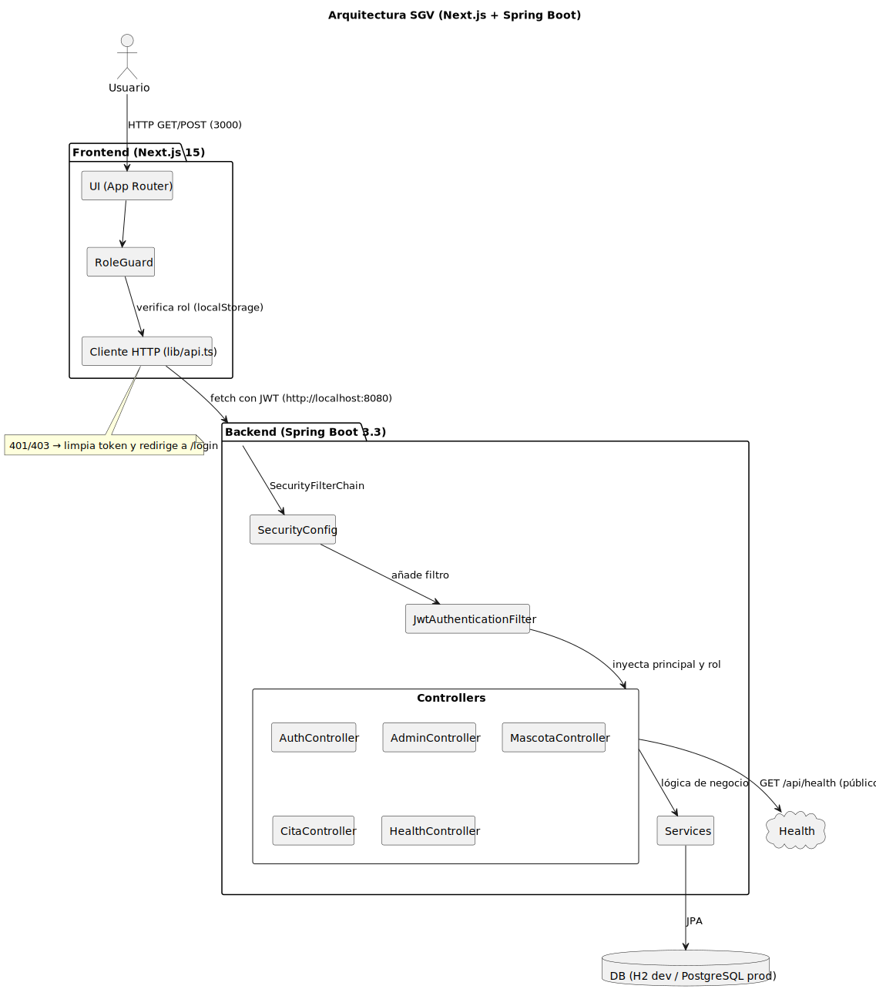

# Arquitectura

- Diagrama: 
- Frontend: Next.js 15 (App Router), TypeScript, Tailwind, shadcn/ui, RoleGuard.
- Backend: Spring Boot 3.3, SecurityFilterChain, JwtAuthenticationFilter, @PreAuthorize.
- DB: H2 (dev) / PostgreSQL (prod).
- `GET /api/health` público.