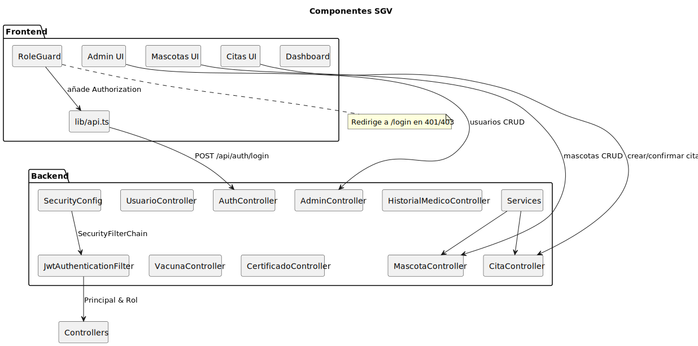

# Componentes

- Diagrama: 
- Frontend: UI, RoleGuard, lib/api.ts.
- Backend: Controllers, SecurityConfig, JwtAuthenticationFilter, Services.

## Frontend
- `RoleGuard`: protege rutas según rol.
- Formularios con validación (Zod + React Hook Form).
- Tablas y filtros con TanStack Table.

## Backend
- `SecurityConfig`: define la cadena de filtros y políticas CORS.
- `JwtAuthenticationFilter`: extrae y valida JWT.
- Controladores por dominio: mascotas, citas, historiales, certificados, vacunas.

## Comunicación
- Base URL backend: `http://localhost:8080`.
- Cliente `lib/api.ts` agrega encabezado `Authorization: Bearer <JWT>`.