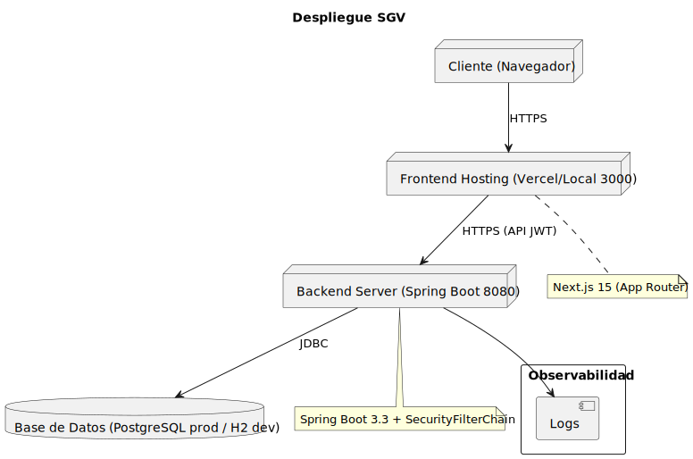

# Despliegue

- Diagrama: 
- Dev: Frontend 3000, Backend 8080, DB H2.
- Prod: Frontend (Vercel/hosting), Backend Spring Boot, DB PostgreSQL.

## Desarrollo local
- Backend: `cd springboot && mvn -q -DskipTests spring-boot:run` → `http://localhost:8080`
- Frontend: `npm run dev -- -p 3000` → `http://localhost:3000`

## Producción
- Frontend: despliegue en Vercel u otro hosting.
- Backend: empaquetar y desplegar Spring Boot; configurar variables.
- Base de datos: PostgreSQL gestionado (Neon u otro proveedor).

## Seguridad
- Habilitar HTTPS.
- Gestionar secretos y claves fuera del repositorio.