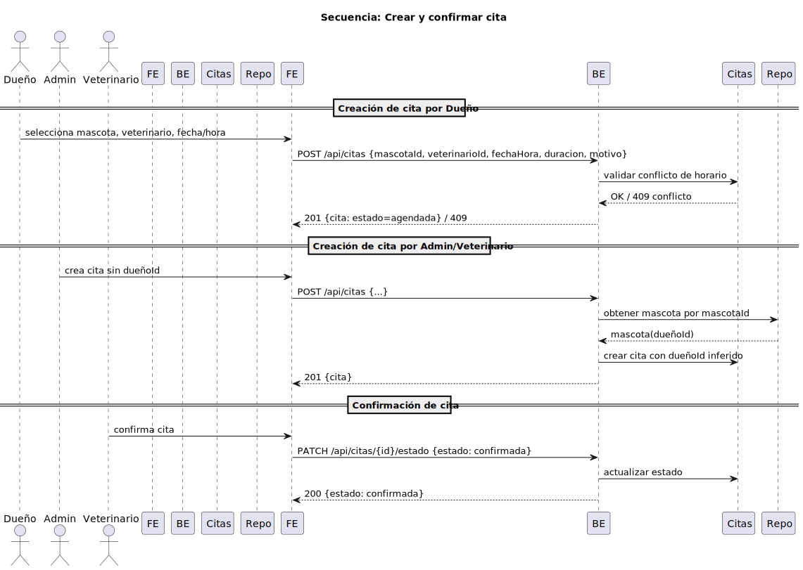

# Flujo: Crear y Confirmar Cita

- Diagrama: 
- Dueño crea cita; admin/vet pueden crear sin `dueñoId` y el backend lo infiere desde la mascota.
- Confirmación por admin/vet vía `PATCH /api/citas/{id}/estado`.

## Pasos
- Seleccionar mascota y veterinario disponibles.
- Elegir fecha, hora y duración (validaciones de conflicto y rango).
- Enviar `POST /api/citas` con motivo y referencias.
- Estado inicial: `agendada`.
- Confirmar con `PATCH /api/citas/{id}/estado` → `confirmada`.

## Reglas
- Dueño puede cancelar su cita.
- Veterinario registra historial al completar.
- Conflictos retornan `409`.