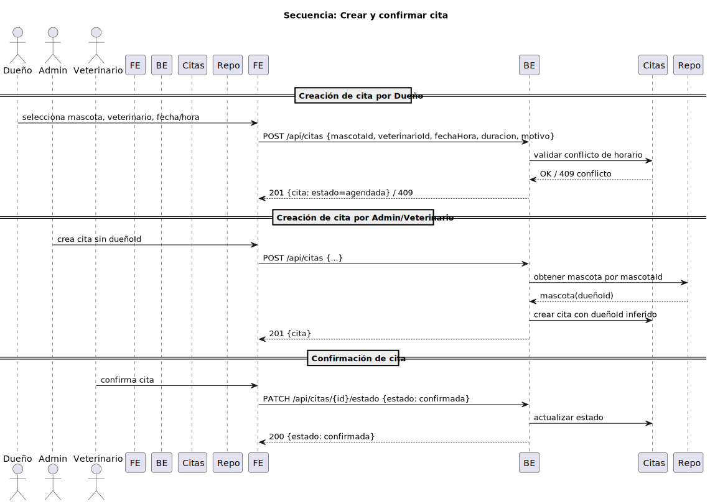

# Flujo: Crear y Confirmar Cita

- Diagrama: 
- Dueño crea cita; admin/vet pueden crear sin `dueñoId` y el backend lo infiere desde la mascota.
- Confirmación por admin/vet vía `PATCH /api/citas/{id}/estado`.